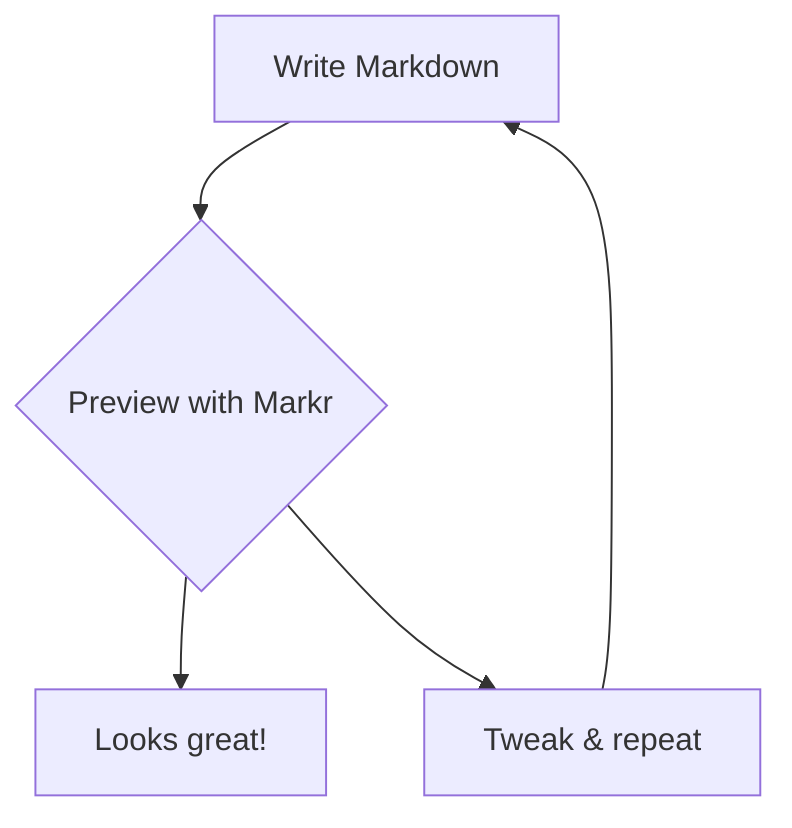

# Markr — Markdown Preview for VS Code

**Beautiful, GitHub-style Markdown preview with a live Table of Contents, syntax highlighting, Mermaid diagrams, scroll sync, focus mode, and more.**

Open any `.md` file and press `Cmd+Shift+M` (Mac) or `Ctrl+Shift+M` (Windows/Linux).

---

## Features

### Live Preview
Renders your Markdown instantly as you type — no save needed.

### GitHub-Style Rendering
Clean, familiar typography that matches GitHub's Markdown output exactly — headings, tables, blockquotes, task lists, strikethrough, and more.

### Syntax Highlighting
190+ programming languages highlighted with accurate GitHub color themes that automatically switch between light and dark mode.

### Table of Contents
Auto-generated TOC sidebar from your headings with:
- **Scroll spy** — active section highlights as you read
- **Smooth scroll** — click any heading to jump there
- **Collapsible** — toggle with the `≡` toolbar button

### Copy Buttons on Code Blocks
Hover any code block to reveal a **Copy** button. One click copies the raw code.

### Heading Anchor Links
Hover any heading to reveal a `#` anchor — click to copy a deep link to that section.

### Scroll Sync
As your cursor moves in the editor, the preview automatically scrolls to the nearest heading. Works silently in the background.

### Focus Mode
Hide the TOC and widen the content area for distraction-free reading. Toggle with the `⊡` button.

### Copy Markdown / Copy HTML
Toolbar buttons to copy the raw Markdown source or the fully rendered HTML — useful for pasting into CMS editors, emails, or docs.

### Print Support
Clean print layout — toolbar and TOC are hidden, content fills the page. Use `⎙ Print` in the toolbar.

### Mermaid Diagrams
Renders ` ```mermaid ` code blocks as interactive diagrams (requires internet for CDN load).

### Dark & Light Mode
Automatically detects your VS Code theme and switches between GitHub Light and GitHub Dark color schemes — no configuration needed.

---

## Usage

| Action | Shortcut |
|--------|----------|
| Open Markr preview | `Cmd+Shift+M` / `Ctrl+Shift+M` |
| Toggle TOC | Click `≡` in toolbar |
| Enter Focus mode | Click `⊡` in toolbar |
| Copy raw Markdown | Click `MD` in toolbar |
| Copy rendered HTML | Click `</>` in toolbar |
| Print | Click `⎙ Print` in toolbar |
| Copy code block | Hover block → click `Copy` |
| Copy heading link | Hover heading → click `#` |

You can also right-click any `.md` file in the **Explorer** and choose **Open Markr Preview**.

---

## Settings

| Setting | Default | Description |
|---------|---------|-------------|
| `markr.scrollSync` | `true` | Sync preview scroll with editor cursor |
| `markr.showTOC` | `true` | Show TOC panel by default |

---

## Mermaid Example

````markdown

````

---

## Requirements

- VS Code `1.80.0` or higher
- Internet connection for Mermaid diagram rendering (other features work offline)

---

## Contributing

Found a bug or have a feature idea? Open an issue on [GitHub](https://github.com/Apptware-Product-Labs/markr).

---

## License

MIT © [Sumit Patil](https://apptware.com) @ [Apptware](https://apptware.com)
