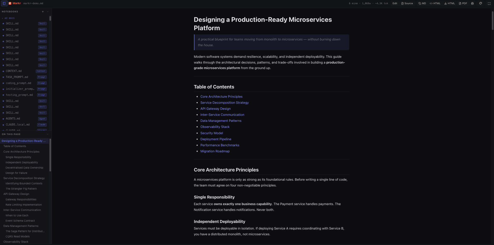
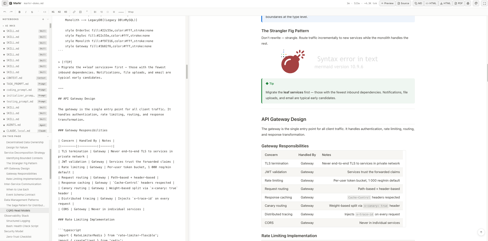
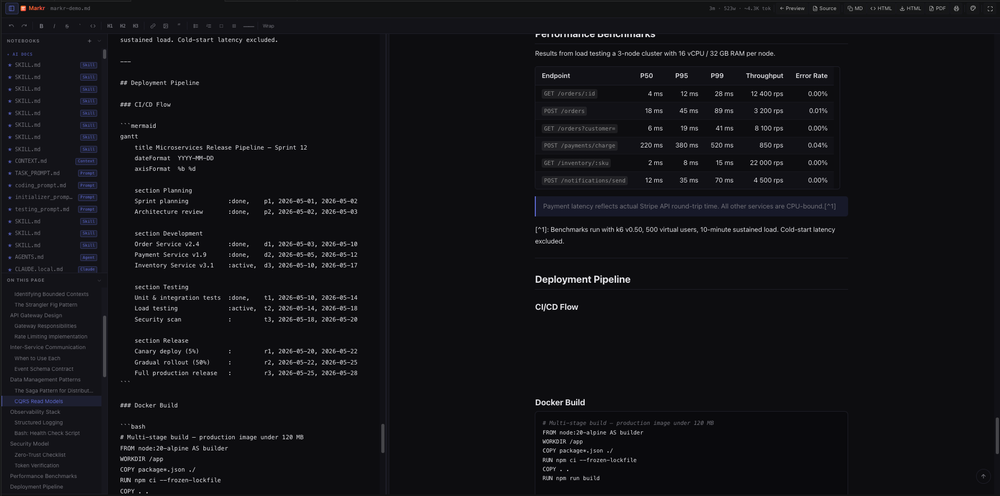
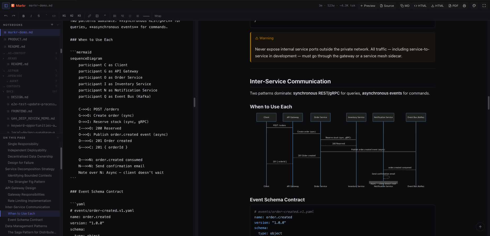
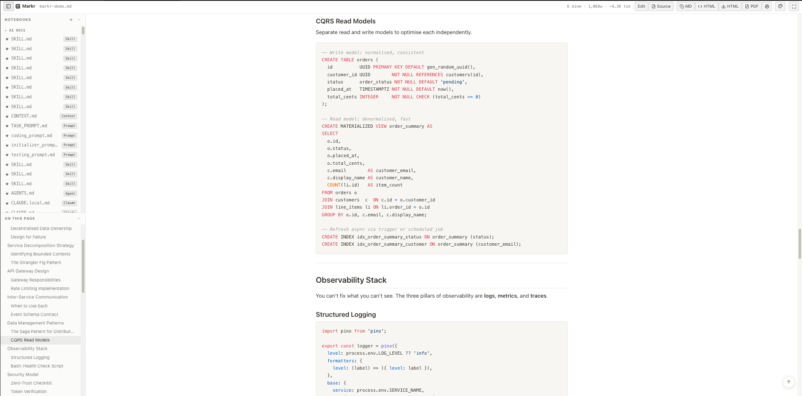
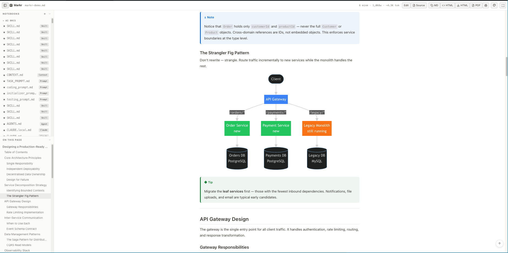
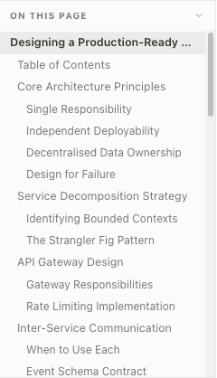

<div align="center">


# Markr

### The Markdown preview & AI config editor VS Code deserves.

**GitHub-accurate rendering · Activity Bar panel · AI config wizard · Mermaid · Copy anything as PNG · Rich copy to Slack/Docs · Paste & preview · Multi-tab · Themes · Export**

<br/>

[](https://marketplace.visualstudio.com/items?itemName=Apptware-Product-Lab.markr)
[](https://marketplace.visualstudio.com/items?itemName=Apptware-Product-Lab.markr)
[](https://open-vsx.org/extension/Apptware-Product-Lab/markr)
[](LICENSE)
[](https://apptware.com)

<br/>

[**Install on VS Code**](https://marketplace.visualstudio.com/items?itemName=Apptware-Product-Lab.markr) · [**Install on Cursor / Open VSX**](https://open-vsx.org/extension/Apptware-Product-Lab/markr) · [**Report a Bug**](https://github.com/Apptware-Product-Labs/markr/issues) · [**Request a Feature**](https://github.com/Apptware-Product-Labs/markr/issues/new)

</div>

---

## What is Markr?

Markr is a free, open-source Markdown preview and AI config editor for VS Code and Cursor. It renders your `.md` files exactly as GitHub does — clean typography, accurate colors, beautiful tables — and goes further with a dedicated Activity Bar panel, full split-edit mode, and first-class support for AI documentation files.

Whether you're managing a `CLAUDE.md`, editing `.cursorrules`, writing Copilot workspace instructions, maintaining a README, or working in a Markdown-heavy repo, Markr gives you a dramatically better experience than the built-in preview.

**Click the Markr icon in the Activity Bar. Or open any `.md` file and press `Cmd+Shift+M`.**

---

## Screenshots

<!-- Hero: full-width preview -->

<p align="center"><sub>Dark theme · Live Table of Contents · Workspace file browser · Word count & reading time</sub></p>

<br/>

<!-- Themes & Editing -->
<div align="center">


</div>
<p align="center"><sub>✦ Notion White theme &nbsp;&nbsp;&nbsp;&nbsp;&nbsp;&nbsp; ✦ Split edit mode — editor + live preview side by side</sub></p>

<br/>

<!-- Diagrams & Syntax -->
<div align="center">


</div>
<p align="center"><sub>✦ Mermaid diagrams — expand fullscreen, copy as PNG &nbsp;&nbsp;&nbsp;&nbsp;&nbsp;&nbsp; ✦ Syntax highlighting — 190+ languages</sub></p>

<br/>

<!-- Alerts & TOC -->
<div align="center">


</div>
<p align="center"><sub>✦ GitHub alerts — NOTE, WARNING, TIP, CAUTION &nbsp;&nbsp;&nbsp;&nbsp;&nbsp;&nbsp; ✦ Collapsible TOC panel with scroll spy</sub></p>

---

## Why Markr?

| | Built-in VS Code Preview | Markr |
|---|:---:|:---:|
| **Activity Bar panel** | ✗ | ✅ Access without opening a file |
| **New AI config wizard** | ✗ | ✅ CLAUDE.md, .cursorrules & more |
| GitHub-accurate styling | Partial | ✅ Pixel-perfect |
| Live Table of Contents | ✗ | ✅ Collapsible, scroll spy |
| Multi-tab navigation | ✗ | ✅ Open multiple files |
| Workspace file browser | ✗ | ✅ Grouped by folder |
| Mermaid diagrams | ✗ | ✅ Flowcharts, Gantt, sequence & more |
| Copy diagram / table / code as PNG | ✗ | ✅ Hover → 📷 Image — paste into Figma, Slack, anywhere |
| Rich copy (Cmd+C) | ✗ | ✅ Pastes formatted content into Slack, Docs, Notion |
| Copy table as formatted HTML | ✗ | ✅ Hover → Copy table — Slack renders it as a real table |
| Paste & preview markdown | ✗ | ✅ Paste any markdown, edit live, save as file |
| File search in sidebar | ✗ | ✅ Filter workspace files instantly |
| Syntax highlighting | Basic | ✅ 190+ languages |
| Copy code buttons | ✗ | ✅ Hover to reveal |
| Word count + reading time | ✗ | ✅ Always visible |
| Export to HTML / PDF | ✗ | ✅ One click |
| Themes | VS Code only | ✅ Light, Dark, Notion, Linear |
| Focus / reading mode | ✗ | ✅ Distraction-free |
| Split edit mode | ✗ | ✅ Preview + editor side by side |
| AI config file support | ✗ | ✅ CLAUDE.md, .cursorrules, Copilot & more |

---

## Features

### 📄 GitHub-Style Rendering
Headings, tables, blockquotes, task lists, strikethrough, footnotes, inline code, fenced code blocks — all rendered exactly as GitHub does. Automatically switches between light and dark with your VS Code theme.

### 📑 Live Table of Contents
Auto-generated from your headings the moment you open the file. Scroll spy highlights the active section in real time. Click any item to jump there. Collapse it with one button.

### 🗂 Activity Bar Panel — Always There
Markr lives in the VS Code / Cursor sidebar as a dedicated panel — no file needs to be open first. The panel shows two sections: **AI Configs** (auto-detected, with tool labels) and **Workspace** (all other `.md` files). Click any entry to open it. The `+` button launches the **New AI Config wizard**.

### 📂 Workspace File Browser
Browse and switch between all `.md` files in your workspace without leaving the preview. Files are grouped by folder, AI config files are pinned at the top, and the browser handles large repos (500+ files) without blocking.

### 🗃 Multi-Tab Navigation
Open multiple Markdown files in tabs — just like your editor. Switching between previously-opened files is instant with no round-trip to the extension host.

### 🎨 Syntax Highlighting — 190+ Languages
TypeScript, Python, Go, Rust, Java, SQL, YAML, Bash, Dockerfile — every language highlighted with GitHub's exact color tokens, in both light and dark themes.

### 🔀 Mermaid Diagrams — Render, Expand, Copy as PNG
Drop a `mermaid` block in your Markdown and Markr renders it live. Flowcharts, sequence diagrams, Gantt charts, class diagrams, and pie charts — all supported.

Hover over any diagram to reveal two buttons:
- **🖼 Copy image** — renders the diagram to a high-resolution PNG (2× retina) and copies it directly to your clipboard. Paste straight into Notion, Slack, Google Docs, email, or any design tool. The PNG background matches your current Markr theme.
- **⤢ Expand** — opens the diagram fullscreen with zoom in/out and Ctrl+scroll support. The **Copy image** button is also available inside the fullscreen modal.

> If clipboard write is blocked by your OS permissions, Markr automatically downloads `diagram.png` instead.

### 📊 Copy Tables as Rich Text or PNG Image

Hover any table to reveal two buttons:

| Button | What it copies | Best for |
|--------|---------------|----------|
| **Copy table** | Rich HTML + tab-separated text | Slack, Google Chat, Google Docs, Notion — pastes as a **real formatted table** |
| **📷 Image** | 2× retina PNG with theme colours | Figma, Confluence, mobile apps, anywhere HTML paste doesn't work |

The **rich copy (Cmd+C)** also works on any selection — select a table, a list, a code block, bold text, a heading — and paste it into any chat or doc app. The formatting (bold, tables, code, lists) is preserved automatically via `text/html`. A brief toast confirms when formatted content was copied.

### 💻 Copy Code Blocks as PNG Image

Every code block already has a **Copy** button (plain text). Now there's also a **📷 Image** button that renders the code block to a clean PNG — monospaced font, your current theme background, 2× retina resolution. Paste code screenshots into design tools, PR descriptions, or slide decks.

### 🔍 File Search in Notebooks Panel

A search box sits below the **Notebooks** section header in the sidebar. Type to filter all workspace Markdown files instantly — matches against both filename and path. Shows a flat list while filtering for fast scanning. Press `×` or `Escape` to clear.

### 📋 Paste & Preview Markdown
Got markdown from Claude, ChatGPT, a PR comment, or any AI tool? Click **Preview Clipboard** in the toolbar (or press `Cmd/Ctrl+Shift+P`) and Markr opens a split edit panel:

- **Left** — an editable textarea pre-filled with your clipboard content. Paste more, edit, rewrite.
- **Right** — the live rendered preview, updating as you type.
- **Save as .md** — pick a location and save the content as a real file in your workspace.
- **Close** — dismisses the panel and returns you to whatever file you had open, with no changes made to it.

The clipboard panel is completely isolated — it never modifies your open files.

### ✦ AI Config Editor — First Class

Markr is built for AI developers. The Activity Bar panel automatically separates your AI config files from regular docs so you can find and edit them instantly.

**Supported out of the box:**

| File | Tool |
|------|------|
| `CLAUDE.md`, `claude.local.md` | Claude Code |
| `.cursorrules`, `cursor.md` | Cursor |
| `.github/copilot-instructions.md` | GitHub Copilot |
| `.windsurfrules`, `windsurf.md` | Windsurf |
| `agent.md`, `agents.md`, `skill.md` | Claude Agents / Skills |
| `system-prompt.md`, `prompt.md` | Generic AI prompts |
| `aider.md` | Aider |
| `codex.md` | OpenAI Codex |

**New AI Config wizard** — click `+` in the Markr panel and pick a template. Markr creates the file (with a useful starter template) and opens it in split edit mode immediately. No more blank files, no more Googling the format.

All AI config files open automatically in **split edit mode** — preview on the right, fully-featured editor on the left. Live token count in the toolbar tells you exactly how much context window you're using.

### ⚡ Scroll Sync
Move your cursor in the editor — the preview scrolls to match. Always in context, never lost.

### 🛠 Toolbar

```
◈ Markr  ·  filename.md      3 min read · 580 words    [Source] [Preview Clipboard] [MD] [HTML] [Print] [PDF] [≡] [⊡]
```

| Button | What it does |
|--------|--------------|
| `Source` | Jump to VS Code's built-in editor for this file |
| `Preview Clipboard` | Open a paste & edit panel — pre-fills with clipboard content, live preview on the right |
| `MD` | Copy raw Markdown to clipboard |
| `HTML` | Copy rendered HTML to clipboard |
| `Print` | Print-ready layout |
| `PDF` | Export as PDF using Chrome/Edge |
| `≡` | Toggle TOC sidebar |
| `⊡` | Focus / reading mode |

### 🎯 Focus Mode
One click hides the sidebar, widens content to 720 px, bumps the font size. Pure reading flow.

### 🎨 Themes
Switch between four themes from the toolbar — **Markr Light**, **Markr Dark**, **Notion White**, **Linear Dark**. Your choice is remembered across sessions.

---

## Getting Started

**VS Code**
1. Open the Extensions panel (`Ctrl+Shift+X` / `Cmd+Shift+X`)
2. Search for **Markr**
3. Click **Install**

**Cursor / VSCodium / Open VSX**
Same search — pulls from [Open VSX Registry](https://open-vsx.org/extension/Apptware-Product-Lab/markr).

**First use — three ways to open Markr**

1. **Activity Bar** — click the Markr icon in the sidebar. Browse all Markdown and AI config files. Click any entry to open it.
2. **Keyboard shortcut** — `Cmd+Shift+M` (macOS) / `Ctrl+Shift+M` (Windows/Linux). Works with or without a `.md` file open. If no Markdown file is active it shows a workspace Quick Pick.
3. **Editor title bar** — the preview icon appears when a `.md` file is open.

---

## Keyboard Shortcuts

| Action | Mac | Windows / Linux |
|--------|-----|-----------------|
| Open Markr Preview | `Cmd+Shift+M` | `Ctrl+Shift+M` |
| Paste Markdown from clipboard | `Cmd+Shift+P` | `Ctrl+Shift+P` |

Also available via:
- The **Markr icon** in the Activity Bar (no file needs to be open)
- The **preview icon** in the editor title bar when a `.md` file is open
- Right-click any `.md` file in Explorer → **Open Markr Preview**
- Command Palette → **Markr: New AI Config File** to create a starter config

---

## Settings

| Setting | Default | Description |
|---------|---------|-------------|
| `markr.scrollSync` | `true` | Sync preview scroll with editor cursor |
| `markr.showTOC` | `true` | Show TOC sidebar when preview opens |
| `markr.maxWorkspaceFiles` | `500` | Max `.md` files shown in the workspace browser |

---

## Requirements

- VS Code `1.80.0` or higher
- Internet connection for Mermaid rendering *(all other features work fully offline)*
- Chrome, Edge, or Chromium for direct PDF export *(falls back to browser print otherwise)*

---

## Contributing

Markr is open source and contributions are welcome.

```bash
git clone https://github.com/Apptware-Product-Labs/markr.git
cd markr
npm install
npm run build     # development build
npm run watch     # rebuild on change
npm run package   # package .vsix
```

1. Fork the repo and create a branch: `git checkout -b feat/your-feature`
2. Make your changes and run `npm run build` to verify
3. Open a pull request with a clear description of what you changed and why

For bugs or feature requests → [open an issue](https://github.com/Apptware-Product-Labs/markr/issues).

---

## Roadmap

- [ ] Custom theme editor
- [ ] Table of Contents depth control
- [ ] Markdown linting indicators
- [ ] Image optimisation on paste

---

## License

MIT — free for personal and commercial use. See [LICENSE](LICENSE).

---

<div align="center">

Built with ❤️ by **[Apptware Labs Pvt Ltd](https://apptware.com)**

*Apptware Labs is a product studio building developer tools and enterprise software — open source and commercial.*

<br/>

**Our Products**

[Markr](https://marketplace.visualstudio.com/items?itemName=Apptware-Product-Lab.markr) &nbsp;·&nbsp; Syncrra &nbsp;·&nbsp; BenchMark &nbsp;·&nbsp; HireFlow

<br/>

[🌐 apptware.com](https://apptware.com) &nbsp;·&nbsp; [GitHub](https://github.com/Apptware-Product-Labs) &nbsp;·&nbsp; [LinkedIn](https://www.linkedin.com/company/apptware)

</div>
