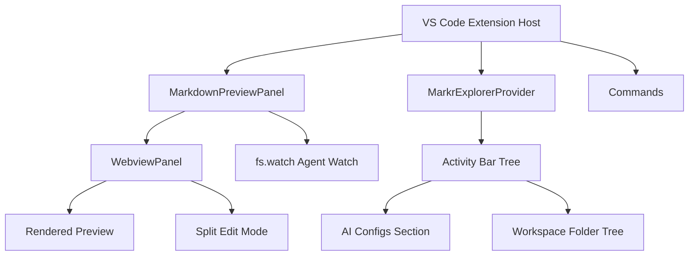
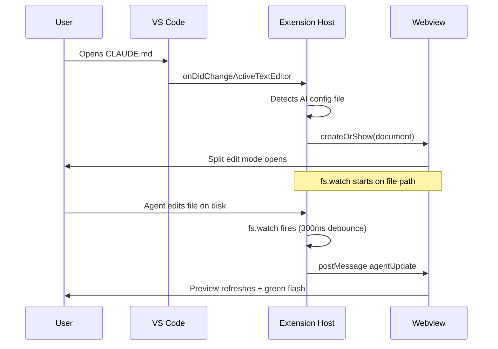

# Markr Architecture

## Overview

Markr is a VS Code extension consisting of three main components:

## Component Responsibilities

### `extension.ts`
- Activates the extension
- Registers all commands (`markr.openPreview`, `markr.newAiConfig`, etc.)
- Auto-opens AI config files in Markr when activated in VS Code
- File system watcher for tree refresh

### `preview.ts`
- `MarkdownPreviewPanel` — the main webview panel
- All HTML, CSS, and JavaScript lives here as TypeScript template literals
- Handles: rendering, editing, clipboard preview, Mermaid, copy features, Agent Watch

### `markrExplorer.ts`
- `MarkrExplorerProvider` — VS Code TreeDataProvider
- Builds the Activity Bar panel with AI Configs + folder tree
- `MarkrFileItem`, `MarkrFolderItem`, `MarkrSectionItem` tree item classes

## Data Flow

