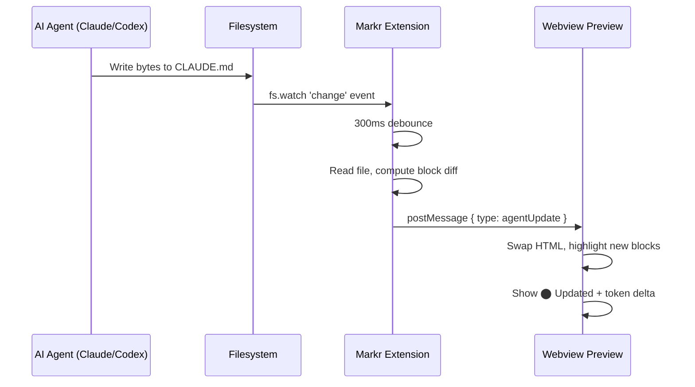

# Agent Watch — Real-Time Live Preview

## What it does

Markr watches your files directly on the filesystem using Node.js `fs.watch`. When Claude Code, Codex, Cursor, or any AI agent edits a file **without saving**, the preview refreshes automatically.

No save event required. No VS Code document event required. Pure filesystem monitoring.

## Visual feedback

| Element | When it appears | What it means |
|---------|----------------|--------------|
| `⬤ Live` badge | Always (for real files) | Markr is watching this file |
| `⬤ Updated` (green pulse) | 3 seconds after each agent edit | Agent just made a change |
| `+N tok` badge | 8 seconds after edit | How many tokens were added |
| `−N tok` badge | 8 seconds after edit | How many tokens were removed |
| Green left border flash | 3 seconds on new blocks | Which sections are new |

## How it works

## Debounce

300ms debounce prevents rapid-fire updates when an agent writes the file in chunks. Each burst of writes within 300ms is treated as one update.

## Limitations

- Only works on real on-disk files (not untitled/virtual)
- Does not interfere while you are manually editing (edit mode active)
- Does not interfere during clipboard preview mode
