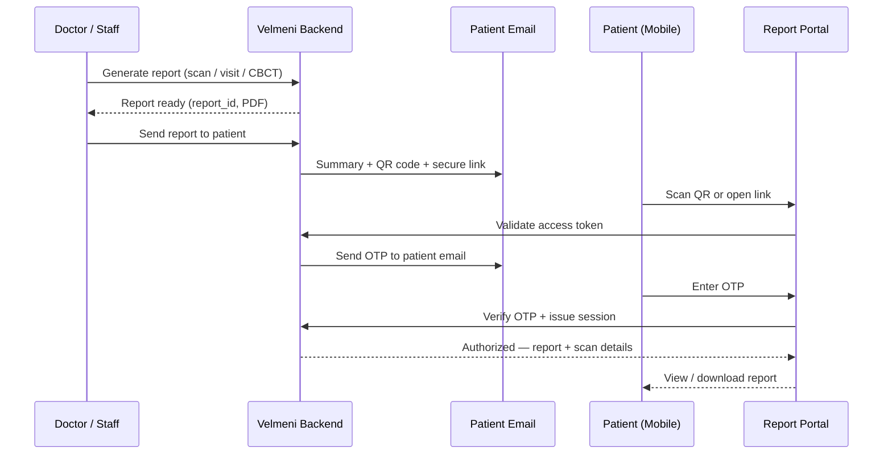
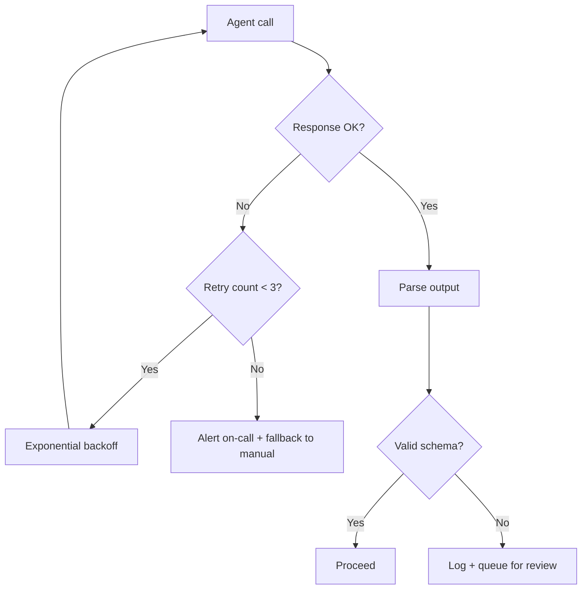

# AI Agent Architecture

> **Project:** Velmeni Health · **Stack:** Next.js + Supabase · **Last updated:** 2026-06-02

## System Overview

This document describes the agent orchestration layer for the Velmeni patient report delivery pipeline. All AI agents operate within a 32k context window.

---

## Patient Report Flow



---

## Agent Responsibilities

| Agent | Role | Context limit | Triggers |
|-------|------|--------------|----------|
| `report-agent` | Generates structured report from scan data | 8k tokens | New scan uploaded |
| `delivery-agent` | Sends report email + OTP flow | 4k tokens | Doctor approves report |
| `qa-agent` | Validates report before delivery | 4k tokens | Pre-delivery hook |
| `triage-agent` | Routes urgent findings to on-call doctor | 16k tokens | Critical marker detected |
| `summary-agent` | Produces patient-facing plain-language summary | 8k tokens | Report finalized |

---

## Tech Stack

```typescript
// Core agent setup
import Anthropic from '@anthropic-ai/sdk';

const client = new Anthropic();

export async function runReportAgent(scanData: ScanData): Promise<Report> {
  const response = await client.messages.create({
    model: 'claude-opus-4-5',
    max_tokens: 2048,
    system: await loadPrompt('report-agent'),
    messages: [
      {
        role: 'user',
        content: JSON.stringify(scanData),
      }
    ],
  });

  return parseReport(response.content[0]);
}
```

---

## Deployment Checklist

- [x] Report agent prompt reviewed by clinical team
- [x] OTP delivery tested on staging
- [x] QA agent false-positive rate < 2%
- [ ] Load test with 1000 concurrent reports
- [ ] HIPAA compliance audit
- [ ] Patient portal mobile responsiveness

---

> [!WARNING]
> The `triage-agent` must never cache responses. Each call must be fresh to avoid stale clinical data being surfaced.

> [!NOTE]
> Token counts shown above are averages. During peak hours, `report-agent` has been observed consuming up to 11k tokens on complex CBCT scans.

---

## Performance Benchmarks

| Metric | Target | Current | Status |
|--------|--------|---------|--------|
| Report generation | < 8s | 5.2s | ✅ |
| OTP delivery | < 3s | 1.8s | ✅ |
| QA validation | < 2s | 3.1s | ⚠️ Needs work |
| End-to-end (patient) | < 20s | 14s | ✅ |

---

## Error Handling


