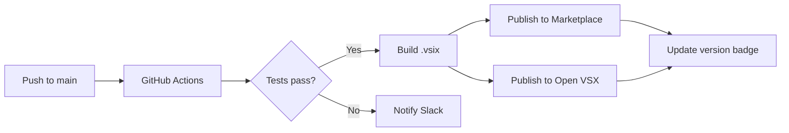
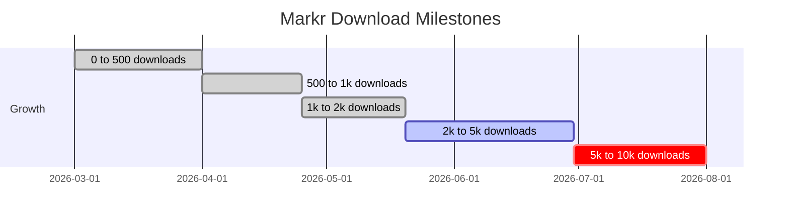

# Developer Tools Comparison

A structured comparison of markdown preview tools, AI config editors, and copy-to-chat workflows for VS Code power users.

---

## Tool Comparison

| Feature | VS Code Built-in | Obsidian | Markr |
|---------|:---:|:---:|:---:|
| Activity Bar panel | ✗ | ✗ | ✅ |
| AI config file support | ✗ | ✗ | ✅ |
| Split edit + live preview | ✗ | ✅ | ✅ |
| Copy table as rich HTML | ✗ | ✗ | ✅ Slack renders it |
| Copy diagram as PNG | ✗ | ✗ | ✅ 2× retina |
| Copy code block as PNG | ✗ | ✗ | ✅ |
| Rich copy (Cmd+C) | ✗ | Partial | ✅ text/html + plain |
| Live token counter | ✗ | ✗ | ✅ |
| Mermaid diagrams | ✗ | Plugin | ✅ Built-in |
| PDF export | ✗ | Plugin | ✅ |
| File search in sidebar | ✗ | ✅ | ✅ |
| Themes | VS Code only | Many | ✅ 4 built-in |
| Works in Cursor | N/A | ✗ | ✅ |

---

## Copy Feature Reference

### What copies what, and where it pastes

| Action | How to trigger | Copies | Pastes correctly in |
|--------|---------------|--------|-------------------|
| Copy table (rich) | Hover table → Copy table | `text/html` + TSV | Slack, Google Chat, Notion, Docs |
| Copy table as image | Hover table → 📷 Image | PNG (2× retina) | Figma, Confluence, anywhere |
| Copy code as image | Hover code → 📷 Image | PNG (2× retina) | Slides, design tools |
| Copy diagram as image | Hover diagram → 🖼 Copy image | PNG (2× retina) | PR descriptions, wikis |
| Rich copy (selection) | Select text + Cmd+C | `text/html` + plain | All rich text apps |

---

## Mermaid Diagrams

### CI/CD Pipeline



### Weekly Download Growth



---

## Code Samples

### Extension activation

```typescript
export function activate(context: vscode.ExtensionContext) {
  const explorerProvider = new MarkrExplorerProvider();

  const treeView = vscode.window.createTreeView('markrExplorer', {
    treeDataProvider: explorerProvider,
    showCollapseAll: true,
  });

  context.subscriptions.push(treeView);

  context.subscriptions.push(
    vscode.commands.registerCommand('markr.openPreview', async () => {
      const editor = vscode.window.activeTextEditor;
      if (editor?.document.languageId === 'markdown') {
        MarkdownPreviewPanel.createOrShow(editor.document);
        return;
      }
      // Smart fallback: show workspace file picker
      await showWorkspaceFilePicker();
    })
  );
}
```

### SVG → PNG clipboard copy

```javascript
async function copyDiagramAsImage(svg) {
  const rect = svg.getBoundingClientRect();
  const canvas = document.createElement('canvas');
  canvas.width  = rect.width  * 2;  // 2× retina
  canvas.height = rect.height * 2;

  const ctx = canvas.getContext('2d');
  ctx.scale(2, 2);
  ctx.fillStyle = getComputedStyle(document.documentElement)
    .getPropertyValue('--bg').trim();
  ctx.fillRect(0, 0, rect.width, rect.height);

  const blob = await svgToPngBlob(svg);
  await navigator.clipboard.write([
    new ClipboardItem({ 'image/png': blob })
  ]);
}
```

---

> [!TIP]
> **Best workflow for AI-generated content:** Copy the Claude or ChatGPT response → `Cmd+Shift+P` in VS Code → Markr opens a split edit panel pre-filled with the content → Mermaid diagrams render on the right → Save as `.md` or copy any element as an image.

> [!NOTE]
> All PNG exports use 2× retina resolution with the current Markr theme's background color baked in. Light theme exports have a white background; Dark/Linear have a dark background.

---

## GitHub Alerts Demo

> [!NOTE]
> This is a **NOTE** — general information worth highlighting.

> [!TIP]
> This is a **TIP** — a useful suggestion or best practice.

> [!WARNING]
> This is a **WARNING** — something that might cause unexpected behaviour.

> [!CAUTION]
> This is a **CAUTION** — potential for data loss or breaking changes.

> [!IMPORTANT]
> This is **IMPORTANT** — critical information that must not be missed.
