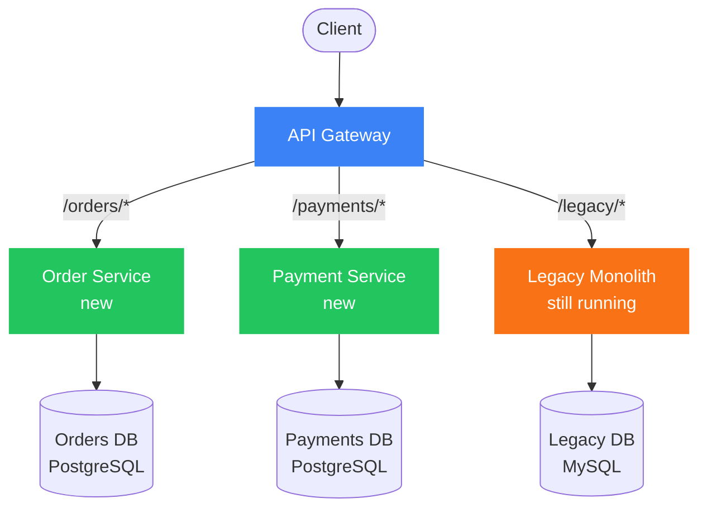
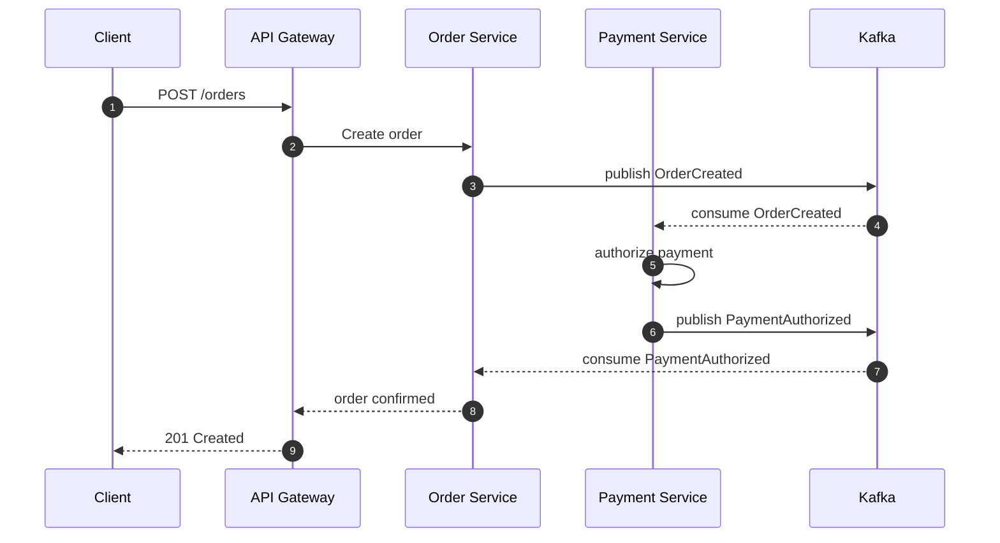
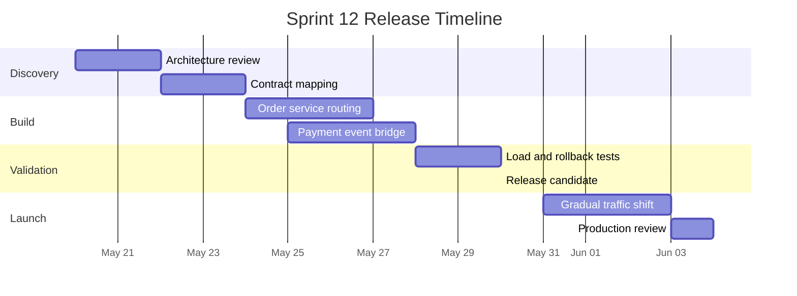

# Markr Feature Showcase

Use this file to verify Markr rendering coverage for architecture diagrams, sequence diagrams, release timelines, GitHub alerts, and syntax highlighting.

## Mermaid Flowchart

The Strangler Fig architecture keeps the monolith running while new services receive traffic incrementally.



## Mermaid Sequence

Order flow between the client, gateway, services, and Kafka.



## Mermaid Gantt

Sprint 12 release timeline with colour-coded phases.



## GitHub Alerts

> [!NOTE]
> Keep the monolith as the source of truth until the new service owns the full workflow.

> [!TIP]
> Route one endpoint family at a time and keep rollback paths simple.

> [!WARNING]
> Do not split the database before ownership boundaries are clear.

> [!IMPORTANT]
> Every new service should publish integration events before traffic is shifted.

> [!CAUTION]
> Avoid a dual-write release unless the failure and replay plan is tested.

## Syntax Highlighting

### TypeScript rateLimitMiddleware

```typescript
import type { Request, Response, NextFunction } from "express";

const hits = new Map<string, { count: number; resetAt: number }>();

export function rateLimitMiddleware(limit = 120, windowMs = 60_000) {
  return function rateLimit(req: Request, res: Response, next: NextFunction) {
    const key = req.ip ?? "anonymous";
    const now = Date.now();
    const bucket = hits.get(key);

    if (!bucket || bucket.resetAt <= now) {
      hits.set(key, { count: 1, resetAt: now + windowMs });
      return next();
    }

    if (bucket.count >= limit) {
      res.setHeader("Retry-After", Math.ceil((bucket.resetAt - now) / 1000));
      return res.status(429).json({ error: "rate_limited" });
    }

    bucket.count += 1;
    return next();
  };
}
```

### SQL CQRS Read Model

```sql
CREATE MATERIALIZED VIEW order_summary AS
SELECT
  o.id AS order_id,
  o.customer_id,
  o.status,
  COALESCE(SUM(i.quantity * i.unit_price), 0) AS gross_total,
  MAX(e.created_at) AS last_event_at
FROM orders o
LEFT JOIN order_items i ON i.order_id = o.id
LEFT JOIN order_events e ON e.order_id = o.id
GROUP BY o.id, o.customer_id, o.status;

CREATE UNIQUE INDEX order_summary_order_id_idx
  ON order_summary (order_id);
```
